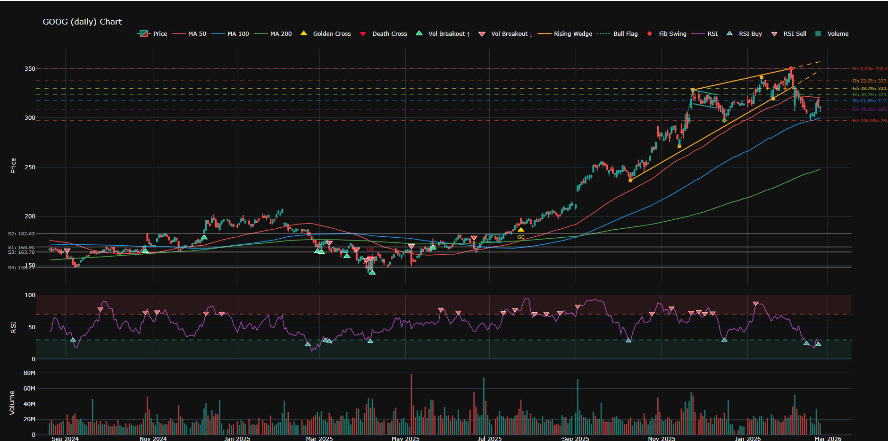

# fin-pocket

[](https://pypi.org/project/fin-pocket/)
[](https://pypi.org/project/fin-pocket/)
[](https://github.com/canyoupleasecreateanaccount/fin-pocket/actions/workflows/ci.yml)
[](https://codecov.io/gh/canyoupleasecreateanaccount/fin-pocket)
[](https://pypi.org/project/fin-pocket/)
[](LICENSE)

Technical analysis signal visualization tool for stocks. Fetches historical data from Yahoo Finance and renders interactive charts with configurable technical signals.



## Features

| Signal | Description | Default |
|--------|-------------|---------|
| **Moving Averages** | MA 50 / 100 / 200 (configurable periods) | On |
| **MA Crossover** | Golden Cross & Death Cross detection | On |
| **RSI** | Relative Strength Index with overbought/oversold zones | On |
| **RSI Divergence** | Bullish/bearish divergence between price and RSI | Off |
| **Support / Resistance** | Pivot-based S/R level detection with clustering | On |
| **Volume Breakout** | S/R breakout confirmed by above-average volume | On |
| **Wedge** | Rising and falling wedge pattern detection | On |
| **Flag & Pennant** | Flagpole + parallel channel or converging triangle | On |
| **Fibonacci Retracement** | Key retracement levels from the last major swing | On |

## Installation

From PyPI:

```bash
pip install fin-pocket
```

From source:

```bash
git clone git@github.com:canyoupleasecreateanaccount/fin-pocket.git && cd fin-pocket
python -m venv venv
source venv/bin/activate   # Linux/macOS
venv\Scripts\activate      # Windows
pip install -e ".[dev]"
```

## Usage

### Basic

```bash
fin-pocket AAPL
```

or via module:

```bash
python -m fin_pocket AAPL
```

### Options

```
positional arguments:
  ticker                Stock ticker symbol (e.g. AAPL, GOOG, MSFT)

options:
  -t, --timeframe {daily,hourly}   Chart timeframe (default: daily)
  -o, --output FILE                Save chart to HTML file
  --height PIXELS                  Chart height in pixels (default: 1000)

signals:
  --no-ma               Disable Moving Averages
  --no-ma-cross         Disable MA Crossover
  --no-rsi              Disable RSI
  --rsi-divergence      Enable RSI Divergence
  --no-sr               Disable Support/Resistance levels
  --no-volume-breakout  Disable Volume Breakout
  --no-wedge            Disable Wedge patterns
  --no-flag             Disable Flag & Pennant patterns
  --no-fibonacci        Disable Fibonacci Retracement
```

### Examples

```bash
# Daily chart for Google with all defaults
fin-pocket GOOG

# Hourly chart for Tesla, no wedges
fin-pocket TSLA --timeframe hourly --no-wedge

# Save to file instead of opening browser
fin-pocket MSFT --output msft_chart.html

# Minimal chart — only price and moving averages
fin-pocket AAPL --no-rsi --no-sr --no-volume-breakout --no-wedge --no-flag --no-fibonacci

# Enable RSI divergence
fin-pocket AMZN --rsi-divergence
```
 
## Project Structure

```
fin-pocket/
├── fin_pocket/
│   ├── __init__.py      # Package version
│   ├── __main__.py      # python -m fin_pocket
│   ├── cli.py           # CLI entry point
│   ├── chart.py         # Plotly chart builder
│   ├── data/
│   │   ├── __init__.py
│   │   └── provider.py  # Yahoo Finance data provider
│   └── signals/
│       ├── __init__.py
│       ├── base.py      # Abstract base signal class
│       ├── moving_averages.py
│       ├── ma_crossover.py
│       ├── rsi.py
│       ├── rsi_divergence.py
│       ├── support_resistance.py
│       ├── volume_breakout.py
│       ├── wedge.py
│       ├── pennant.py   # Flag & Pennant
│       └── fibonacci.py # Fibonacci Retracement
├── tests/
│   └── ...
├── pyproject.toml
├── LICENSE
└── README.md
```

## Running Tests

```bash
pytest
pytest --cov=fin_pocket
```

## Building & Publishing

```bash
pip install build twine
python -m build
twine upload dist/*
```

## Dependencies

- **yfinance** — historical market data from Yahoo Finance
- **pandas** — data manipulation
- **plotly** — interactive charting
- **numpy** — numerical computations

## Contributing

See [CONTRIBUTING.md](CONTRIBUTING.md) for how to submit pull requests.

## Contact

Email: solveme.solutions@gmail.com

## Support

<a href="https://www.buymeacoffee.com/yourCrowley" target="_blank"></a>

## License

Proprietary — for personal use only. See [LICENSE](LICENSE).
